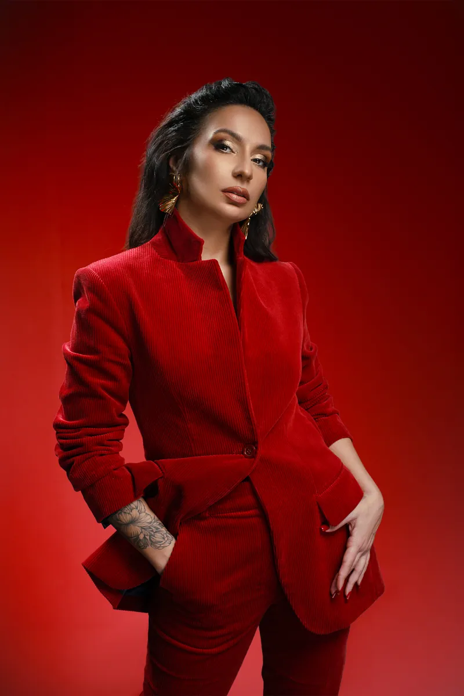
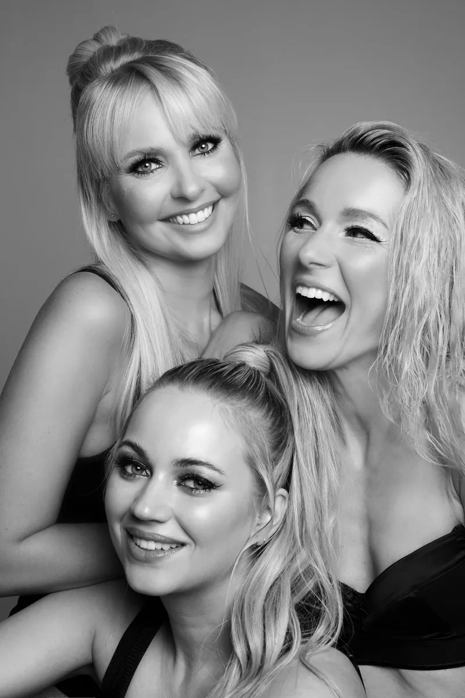
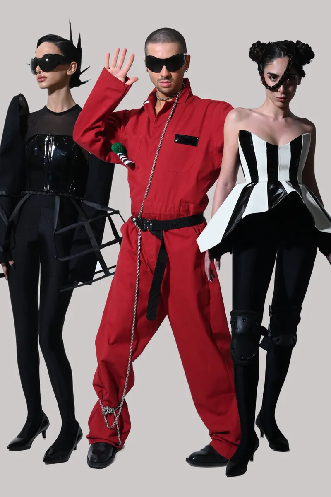
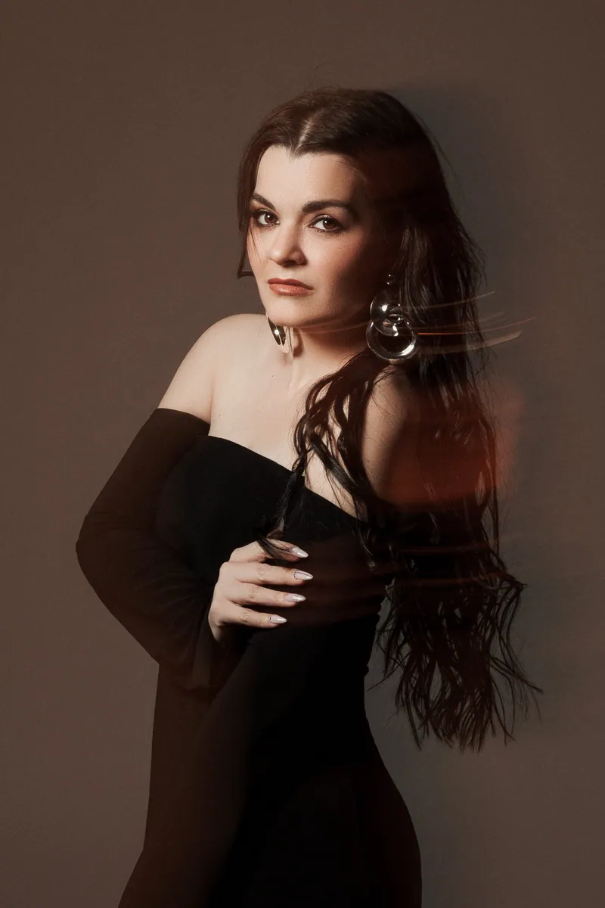
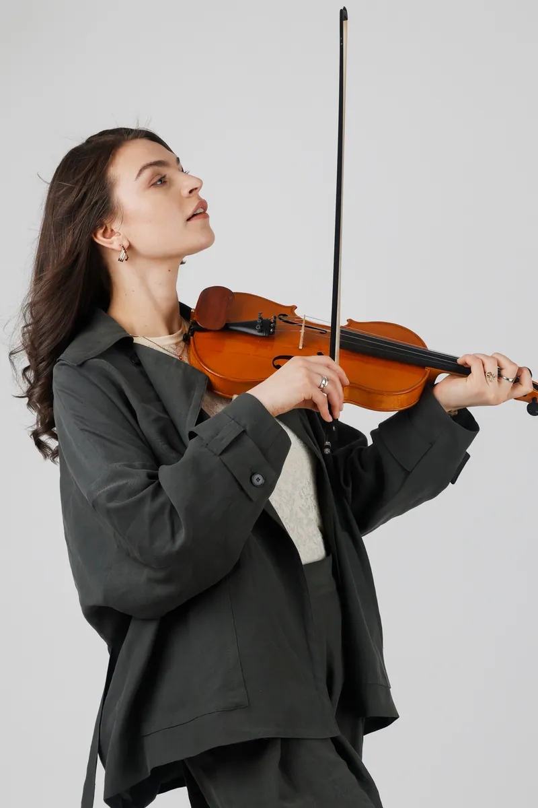
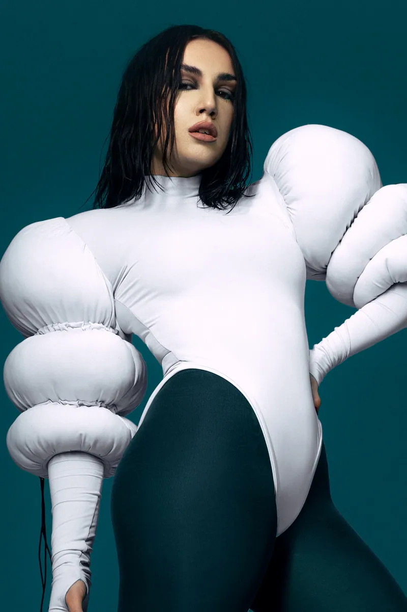
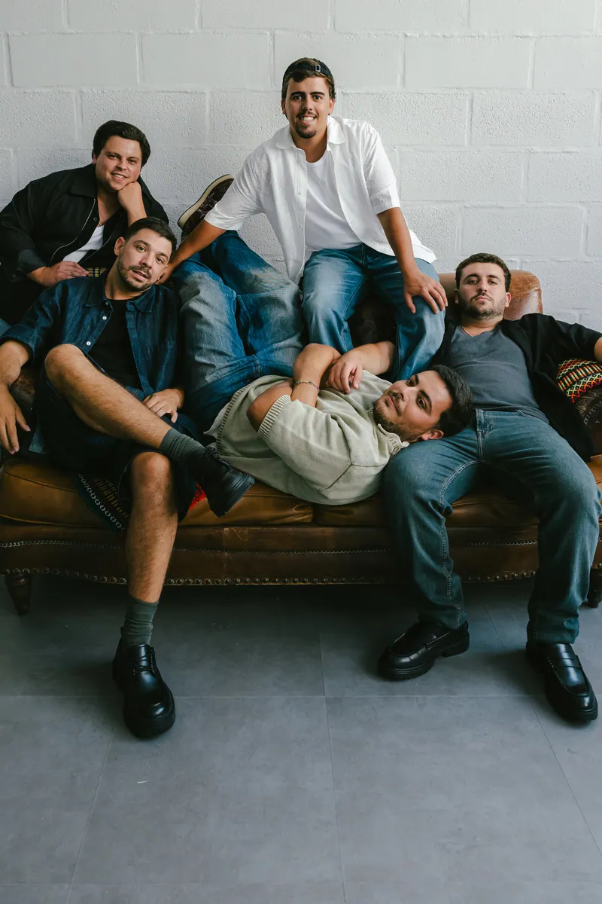
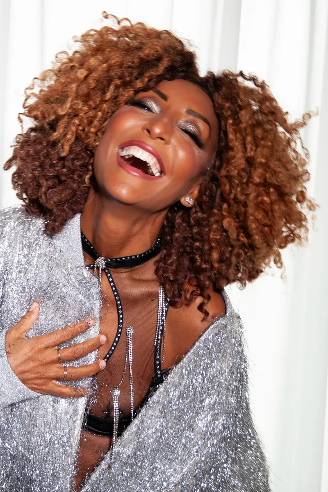
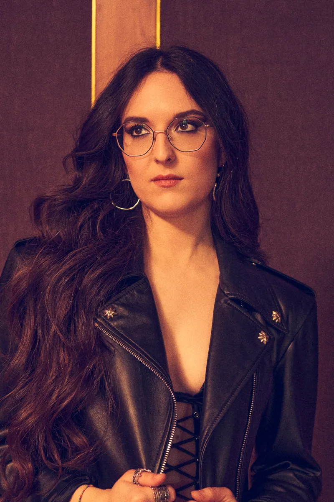

# Eurovision 2026 Grand Final — Participants

35 countries compete in the Grand Final in Vienna, 2026.

| Country | Artist | Song | Image |
|---------|--------|------|-------|
| Albania | Alis | Nân |  |
| Armenia | Simón | Paloma Rumba |  |
| Australia | Delta Goodrem | Eclipse |  |
| Austria | Cosmó | Tanzschein |  |
| Azerbaijan | Jiva | Just Go |  |
| Belgium | Essyla | Dancing on the Ice |  |
| Bulgaria | Dara | Bangaranga |  |
| Croatia | Lelek | Andromeda |  |
| Cyprus | Antigoni | Jalla |  |
| Czechia | Daniel Zizka | Crossroads |  |
| Denmark | Søren Torpegaard Lund | Før vi går hjem |  |
| Estonia | Vanilla Ninja | Too Epic to Be True |  |
| Finland | Linda Lampenius and Pete Parkkonen | Liekinheitin |  |
| France | Monroe | Regarde ! |  |
| Georgia | Bzikebi | On Replay |  |
| Germany | Sarah Engels | Fire |  |
| Greece | Akylas | Ferto |  |
| Israel | Noam Bettan | Michelle |  |
| Italy | Sal Da Vinci | Per sempre sì |  |
| Latvia | Atvara | Ēnā |  |
| Lithuania | Lion Ceccah | Sólo quiero más |  |
| Luxembourg | Eva Marija | Mother Nature |  |
| Malta | Aidan | Bella |  |
| Moldova | Satoshi | Viva, Moldova! |  |
| Montenegro | Tamara Živković | Nova zora |  |
| Norway | Jonas Lovv | Ya Ya Ya |  |
| Poland | Alicja | Pray |  |
| Portugal | Bandidos do Cante | Rosa |  |
| Romania | Alexandra Căpitănescu | Choke Me |  |
| San Marino | Senhit | Superstar |  |
| Serbia | Lavina | Kraj mene |  |
| Sweden | Felicia | My System |  |
| Switzerland | Veronica Fusaro | Alice |  |
| Ukraine | Leléka | Ridnym |  |
| United Kingdom | Look Mum No Computer | Eins, Zwei, Drei |  |
